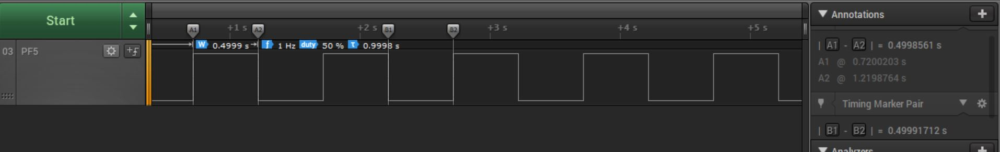
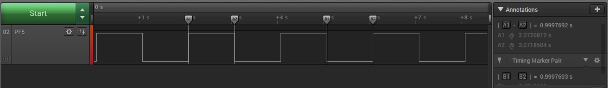
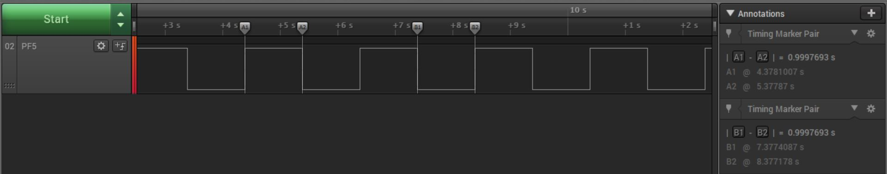

# Real-Time Counter (RTC) in Three Different Modes Using the AVR64DD32 Microcontroller Generated with MCC Melody

 The repository contains three MPLAB® X projects:

1.  [Overflow Interrupt](#1-overflow-interrupt) – This code example shows how to use the Real-Time Counter (RTC) with overflow interrupt enabled to toggle an LED using MCC Melody. The overflow period is 500 ms. The on-board LED will be toggled each time the overflow interrupt occurs.
2.  [Periodic Interrupt](#2-periodic-interrupt) – This project shows how to use the Periodic Interrupt Timer (PIT) timing function of the Real-Time Counter (RTC) using MCC Melody. The on-board LED will be toggled each time the periodic interrupt occurs.
3.  [PIT Wake from Sleep](#3-pit-wake-from-sleep-mode) – This project shows how to use the Periodic Interrupt Timer (PIT) timing function of the Real-Time Counter (RTC) to wake up the CPU from Sleep mode using MCC Melody. The on-board LED will be toggled each time the periodic interrupt occurs, meaning it will be toggled when the CPU wakes up from Sleep. 
 
## Related Documentation

More details and code examples on the AVR64DD32 can be found at the following links:

- [AVR64DD32 Product Page](https://www.microchip.com/wwwproducts/en/AVR64DD32)
- [AVR64DD32 Code Examples on GitHub](https://github.com/microchip-pic-avr-examples?q=AVR64DD32)
- [AVR64DD32 Project Examples in START](https://start.atmel.com/#examples/AVR64DD32CuriosityNano)

## Software Used

- [MPLAB® X IDE](http://www.microchip.com/mplab/mplab-x-ide) v6.00 or newer
- [MPLAB® XC8](http://www.microchip.com/mplab/compilers) v2.36 or newer
- [AVR-Dx Series Device Pack](https://packs.download.microchip.com/) v2.1.152 or newer

## Hardware Used

- The AVR64DD32 Curiosity Nano Development board is used as a test platform
   
- Saleae Logic Analyzer 8

## Operation

To program the Curiosity Nano board with this MPLAB® X project, follow the steps provided in the [How to Program the Curiosity Nano Board](#how-to-program-the-curiosity-nano-board) chapter.  

## 1. Overflow Interrupt

This project shows how to use the RTC with overflow interrupt enabled to toggle an LED. The overflow period is 500 ms. The on-board LED will be toggled each time the overflow interrupt occurs.

### 1.1 Setup

The following configurations must be made for this project:

- Main clock
  - The default settings are used for the main clock
  - Use the 32 kHz external crystal as a clock source for the RTC
- RTC
  - Configure the period value: 500 ms
  - Configure the clock source: 32.768 kHz External Crystal Oscillator
  - Run in Debug mode, run in Standby are enabled
  - Configure the prescaler: 32
  - Enable the overflow interrupt
  - Enable the RTC
- PF5 (LED) is configured as output
- The global interrupts are enabled
- Logic Analyzer connected on PF5

|Pin                       | Configuration      |
| :---------------------:  | :----------------: |
|         PF5 (LED) 	     |   Digital output   |

### 1.2 Demo

- The LED toggled on the RTC overflow interrupt is presented below.
 

- The signal that drives the LED is shown below. The measured pulse width is, as expected, 500 ms.
 

### 1.3 Summary

This project shows how to configure the RTC overflow interrupt to toggle an LED. When the overflow interrupt occurs, the on-board LED is toggled.   
[Back to top](#real-time-counter-rtc-in-three-different-modes-using-the-avr64dd32-microcontroller-generated-with-mcc-melody) 

## 2. Periodic Interrupt

This project shows how to use the PIT timing function of the RTC. The on-board LED will be toggled each time the periodic interrupt occurs.

### 2.1 Setup

The following configurations must be made for this project:

- Main clock
  - The default settings are used for the main clock
  - Use the 32 kHz external crystal as a clock source for the RTC
- RTC
  - Configure the clock source: 32.768 kHz External Crystal Oscillator
  - Run in Debug mode, run in Standby are enabled
  - Enable the RTC periodic interrupt and configure the RTC period clock cycles: 32768. This means the period is 1s.
  - Enable the Periodic Interrupt Timer (PIT)
- PF5 (LED) is configured as output
- The global interrupts are enabled
- Logic Analyzer connected on PF5

|  Pin                    |  Configuration     |
| :---------------------: | :----------------: |
|       PF5 (LED)         |   Digital output   |

### 2.2 Demo

- The LED toggled on the PIT periodic interrupt is presented below. The LED will be toggled each second.
 

- The signal that drives the LED is shown below. The measured pulse width is, as expected, 1s.
 

### 2.3 Summary

This project shows how to configure the PIT function of the RTC to toggle an LED. When the periodic interrupt occurs, the on-board LED is toggled.   
[Back to top](#real-time-counter-rtc-in-three-different-modes-using-the-avr64dd32-microcontroller-generated-with-mcc-melody) 

## 3. PIT Wake from Sleep Mode

This project shows how to use the PIT timing function of the RTC to wake up the CPU from Sleep. The on-board LED will be toggled each time the periodic interrupt occurs, meaning it will be toggled when the CPU wakes up from Sleep. 

### 3.1 Setup

The following configurations must be made for this project:

- Main clock
  - The default settings are used for the main clock
  - Use the 32 kHz external crystal as a clock source for the RTC
- RTC
  - Configure the clock source: 32.768 kHz External Crystal Oscillator
  - Run in Debug mode, run in Standby are enabled
  - Enable the RTC periodic interrupt and configure the RTC Period clock cycles: 32768. This means the period is 1s.
  - Enable the Periodic Interrupt Timer (PIT)
- SLPCTRL
  - Enable the Power-Down Sleep mode
  - Enable Sleep mode
- PF5 (LED) is configured as output
- The global interrupts are enabled and the CPU is put to Sleep
- Logic Analyzer connected on PF5

|  Pin                    | Configuration      |
| :---------------------: | :----------------: |
|         PF5 (LED) 	  |   Digital output   |

### 3.2 Demo

- The LED toggled on the PIT periodic interrupt, when the CPU exits Sleep mode, is presented below. The LED will be toggled each second.
 

- The signal that drives the LED is shown below. The measured pulse width is, as expected, 1s.
 

### 3.3 Summary

This project shows how to configure the PIT function of the RTC to toggle an LED. When the periodic interrupt occurs, the on-board LED is toggled. Otherwise, the CPU is in Power-Down Sleep mode.   
[Back to top](#real-time-counter-rtc-in-three-different-modes-using-the-avr64dd32-microcontroller-generated-with-mcc-melody) 

# 

##  How to Program the Curiosity Nano Board

This chapter demonstrates how to use the MPLAB® X IDE to program an AVR® device with an Example_Project.X. This can be applied for any other projects.

1.  Connect the board to the PC.

2.  Open the Example_Project.X project in MPLAB® X IDE.

3.  Set the Example_Project.X project as main project.
     Right click the project in the **Projects** tab and click **Set as Main Project**.
     

4.  Clean and build the Example_Project.X project.
     Right click the **Example_Project.X** project and select **Clean and Build**.
     

5.  Select **AVRxxxxx Curiosity Nano** in the Connected Hardware Tool section of the project settings:
     Right click the project and click **Properties**
     Click the arrow under the Connected Hardware Tool
     Select **AVRxxxxx Curiosity Nano** (click the **SN**), click **Apply** and then **OK**:
     

6.  Program the project to the board.
     Right click the project and then **Make and Program Device**.
     

 

- [Back to 1. Overflow Interrupt](#1-overflow-interrupt)
- [Back to 2. Periodic Interrupt](#2-periodic-interrupt)
- [Back to 3. PIT Wake from Sleep Mode](#3-pit-wake-from-sleep-mode)
- [Back to top](#real-time-counter-rtc-in-three-different-modes-using-the-avr64dd32-microcontroller-generated-with-mcc-melody) 

